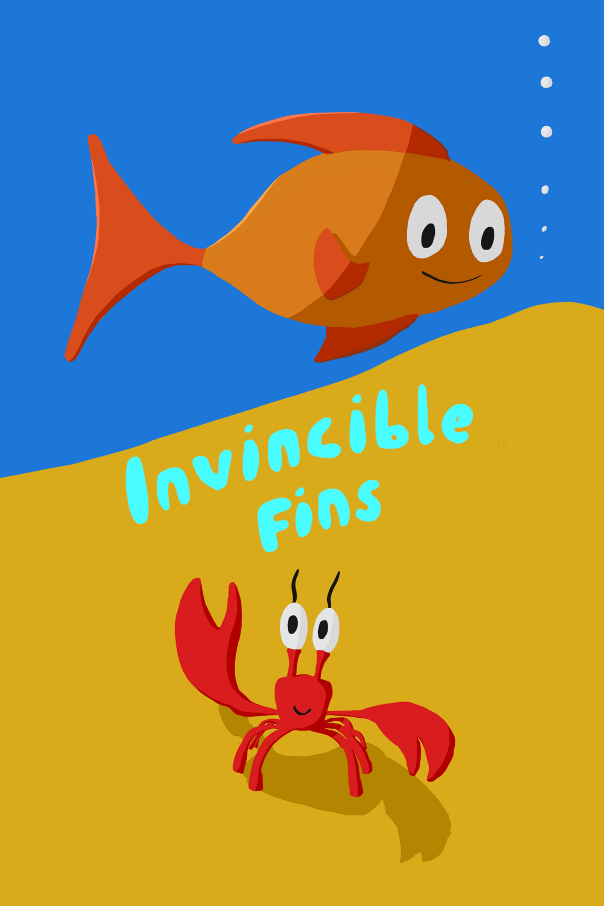

# Reggelente

Reggelente is a small indie game development company based in Budapest, Hungary. Check out our first game:

# Invincible Fins

A game recommended for younger kids. You control a little fish that just got back to the ocean from a thrown away aquarium. Explore the colorful underwater world, collect treasures, avoid dangers and find your new home.

For more information, see [Invincible Fins](https://invinciblefins.com)
